WORK IN PROGRESS!!!!

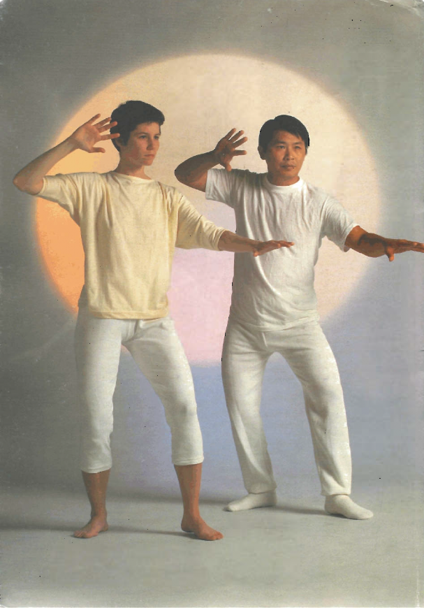

# Preface

## How to Use this Book

This book will help you master the basic Zhan Zhuang system of Chi Kung internal energy exercise. The instructions are based on the experience of many masters and their students: if you follow them precisely you will be in safe hands.

Part One introduces the warm ups and the first two standing exercises and outlines the sensations that you may feel when begin- ning or progressing to a new level. Part Two takes you on to the intermediate level, with a more powerful series of warm up exercises, and three more standing positions. The four most advanced postures are introduced in Part Three, along with "mentality exercises", which are visualization techniques used to enhance the effectiveness of

the postures. Part Four explains how Zhan Zhuang can be incorpor- ated into everyday life. The last chapter deals with the self-treatment of minor ailments.

The techniques presented in this book are available to people of all ages and levels of fitness. Chapter 9 gives programmes for those starting Zhan Zhuang at different stages of life, for example, in middle age, and for the elderly. It is very important to respect the advice on each of the exercises and not to skip ahead to try out something that is too advanced for you.

Unlike keep-fit systems that set fixed regimes, Zhan Zhuang allows for your individuality. You can progress at your own pace, working carefully and systematically through the exercises, following the guidelines in Parts One to Three of this book. Once you are com- fortable doing each exercise, you will be able to create a daily programme of your own, drawing on the postures and techniques you have learned.

Like all good exercise systems, regular practice is essential. There is no point in rushing ahead, seeking instant results. Zhan Zhuang works on your internal energy patterns and usually manifests external results only after a few months. If you practise these ex- ercises as part of your daily routine, you will continue to develop your internal power over a whole lifetime.

The drawings and photographs in this book have been super- vised by Master Lam Kam Chuen. If you are able to find a qualified instructor, this book will be a permanent resource for your training.

**A WORD OF CAUTION**

Positions 6 to 9 (pp. 104-119) in this book have a strong effect on your circulatory system and, as with all intense exercise, push up your blood pressure during the period of training. Attempt these positions only if your doctor advises that your normal blood pressure level will permit this.

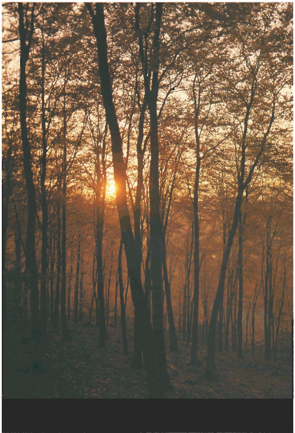

## FOREWORD

*by Professor Yu Yong Nian Honorary Member of the Council of the Association of Chi Kung Science of the People's Republic of China and adviser to the American - Chinese Chi Kung Association.*

For centuries the art of internal strength was a closely guarded secret in China. Embracing all the hard and soft martial arts including Tai Chi and Chi Kung, it is only now that it is being unveiled, both in my country and to the world outside.

My experience of the extraordinary benefits of the Zhan Zhuang style of Chi Kung exercise stretches over the past 50 years, during which time I have studied its application in hospitals and clinics throughout China. People of all ages have come to be treated for disorders that often neither Western medicine nor traditional Chinese medicine could cure: hypertension; arthritis; some tumours, and other chronic disorders of the respiratory, cardiovascular, and nervous systems.

The time has come to make this system of preventative and therapeutic health care open to everyone. The Way of Energy makes a unique contribution to understanding the health and potential that is the natural heritage of every human being. I am pleased to have been able to collaborate in this with Master Lam Kam Chuen of Hong Kong. A qualified practitioner of traditional Chinese medicine, he has contributed to my own experience as a surgeon in the Western medical tradition, both through his own research in the ancient study of Chi (vital energy) and through his years of clinical work healing people with bone, nerve, and muscle injuries.

It is rare to find an authentic master of an ancient art. Since the age of 12, Lam Kam Chuen has devoted himself to the internal strengthening and healing of the human body.

Since those early days he has studied under masters in Hong Kong, Taiwan, and China, embracing a traditional range of studies that includes herbal medicine, the martial arts, the great religious philosophies of Chinese culture, and classical Chinese opera. He is one of the most highly trained and deeply knowledgeable experts in the art of healing and the study of internal strength currently practising and teaching in the Western world. Master Lam is the founder of the first and only clinic of its type in Europe for treating people on the basis of this powerful yet profoundly natural system. The clinic, opened in 1991, can be found near the heart of London's Chinatown.

Master Lam invited one of his students, Richard Reoch, to work with him in creating The Way of Energy, the first reference book on Zhan Zhuang for the Western reader. Born into a Buddhist family in Canada in 1948, Richard Reoch is one of a small group of people who began studying Zhan Zhuang under Master Lam in the 1980s.

Working together for more than a year, and drawing on Master Lam's own knowledge, his library of Chinese texts, his Western medical works, and the experience of his students and patients, they have distilled a whole culture and a completely different way of understanding human beings into a form penetrable by the Western mind.

This book is a great achievement and I am delighted to think that The Way of Energy will be read in many countries and languages all over the world. I trust that everyone who has the opportunity to study it will be rewarded by its immense, hidden treasure.

Yu Yong Nian November 1990

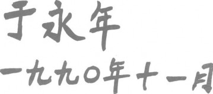

## INTRODUCTION

In the early morning, before the hubbub of daily life, Chinese people of all ages begin the day by performing traditional exercises in the parks and woods wherever they live. You will see some doing rhythmic stretching movements - others are training in the martial arts. A common sight is Tai Chi Chuan, the exquisite slow exercise, one of the soft martial arts, that develops and relaxes the whole body. The first time that you see so many people, sojne in their eighties and others in their very early youth, all peacefully training together under the trees, is one of life's unforgettable moments.

But as you look more closely you may come across an even more remarkable sight. Among all these moving forms, here and there you will see some figures that rivet your attention. They are like the trees themselves. They are fully alive, but they are utterly still.

Although there is no obvious movement, they are deeply engaged in one of the most demanding and powerful forms of exercise ever developed. It is so utterly focused on deep, internal growth that it literally requires learning to stand like a tree. It is known in Chinese as Zhan Zhuang, "standing like a stake", or "standing like a tree". It is pronounced "Jan Jong", or, in southern China, "Jam Jong". This is the system to which you are about to be introduced in this book.

Like a tree with its deep roots, powerful trunk, and great spreading branches reaching into the sky, you will appear to remain unmoving. In reality you will be growing from within. Previously shrouded in secrecy, this health system is now attracting considerable international attention and scientific examination. The results are unmistakable: strengthened immunity; successful treatment of chronic illness; high levels of daily energy and the natural regeneration of the nervous system.

The Zhan Zhuang system of energy exercises takes most people completely by surprise, because although it is most definitely an energetic system of exercise, it involves virtually no movement! Unlike almost all other exercise methods, which consume energy, this actually generates energy. How is this possible? The answer lies in the nature of energy in the human body: how it is produced, and how it moves within the body.

### YOUR NATURAL ENERGY

Our bodies are filled with energy, but it is blocked within us. We are born bursting with life, yet we grow old depleted of vitality.

Zhan Zhuang is a unique exercise that reverses this process of decay. Developed in China, it builds up and releases an extraordinary flow of natural energy that is dormant inside us, and raises the body and mind to remarkably high levels of fitness.

The energy in our bodies is so natural and so spontaneous, we almost never stop to think about it. It is like the constant rhythm of our lungs and the ceaseless circulation of our blood. Thousands upon thousands of chemical reactions are taking place at any one moment and countless electrical impulses are passing through every part of the system. Not only that, but we are all part of the entire flow of energy around us. The intricate networks of energy in your body form part of the energy of the natural world. You are a miniature field of the electromagnetic energy of the universe.

### ORIGINS OF ENERGY

We begin with the fusion of the life energies of our parents. From the moment of conception, a new pattern of vitality is born and begins to grow. Floating effortlessly in the fluid of the womb, we absorb nutrition, protection, and immunity. We move with the rhythm of our mothers' bodies. Sustenance flows into us through the umbilical cord at the centre of our emerging being.

But from the moment of birth we undergo radical changes. The sustenance that previously came to us in the womb must now come from elsewhere. We are forced to draw it in for ourselves using our lungs, mouths, senses, and muscles.

Over time, even the way we breathe begins to change. At first we breathe naturally, from the belly, as if still centred around the umbilical cord. But as we age, the centre of breathing gradually moves upward in the torso, so that by late childhood most people think that they control their breathing with their chest muscles. little by little, just staying alive causes tension to accumulate in our chests, shoulders, necks, and brains.

From the moment we first open our eyes as newborn babies our lives fill up with motion. We see everything around us constantly moving. Our bodies are continuously experiencing nervous and muscular tension of one sort or another. Our minds are endlessly being pulled this way or that. Even when we sleep, research has shown that our mental activity continues. If you ask people to stop thinking for a few moments and just forget everything, you will most likely find that they simply cannot do it. Their minds continue to scamper around like a monkey.
The mental tensions in our lives have a direct and disastrous effect on everything else. A very high proportion of the most common ailments that afflict people are related to tension — either as a direct result of it, such as headaches, heart attacks, and nervous disorders, or indirectly, as a result of the body's internal organs and immune system being weakened by tension in the muscles, organs, and nerves.
We rarely relax. Our original state of tranquil growth is lost to us. We move about in the air, but we are unable to rest in it as we once were able to rest in the waters of the womb. People try all sorts of ways to relax: watching television; listening to music; jogging; eating and, of course, sleeping. Others find yoga and meditation helpful. But only rarely do any of these ways relax both the nervous system and the entire muscle system.
In the practice of Zhan Zhuang, however, we can find a way to relax the nervous and the muscular systems simultaneously. This clears the pathway for the renewed circulation of the original, natural energy in our bodies and minds.
Doing this is the secret of the Way of Energy.

*ARE THEY CHEATING ME?"*

*The first time someone told me to stand like a free I didn 't believe them. I was in my early twenties at the time. I had grown up in Hong Kong and trained to be a traditional
Chinese doctor. Since I was 12 1 had studied martial arts and been to many tournaments. By most people's standards you would have to say I was a serious martial artist and was physically fit. Now here was someone telling me: "Ifyou want to learn the real thing, you should stand still without
moving." It looked like nothing, but I tried it. I couldn 't believe it: whatever was going on, it was far more demanding than any of the countless hours of hard physical exercise I had
put in during my youth.
For several years after that I tried to find a competent Zhan Zhuang teacher. When I succeeded, I was told only one thing:
stand without moving. I asked many questions but got no reply. I was told: "fust do it". For one year that was all I was taught. I began to ask myself "Am I stupid? Are they cheating me?" But I continued practising every day and after one year
when my teacher saw that I was prepared to stand like that and not ask questions, he started to explain it to me!
Slowly I began to understand what was happening inside my body. I started to know my own internal power. My whole
approach changed, including my approach to the martial arts. Then, because I was continuing my traditional medical practice, I was told I ought to contact Professor Yu Yong Nian, a dentist and master of Zhan Zhuang in Beijing, who, in turn, had studied under Wang Xiang Zhai, the Grandmaster of Zhan Zhuang in its modern form. After a long correspondence, we finally met and eventually I was able to train under him and learn not only the exercise system but
also its powerful application in the healing arts.
These days, even after all the years of training and study, I understand exactly what my students must be thinking at the very beginning when I show them how to stand and then tell them: "Just do it!". I think to myself years ago I didn't believe any of this. It seems to defy everything we have beeii brought up to think. Butl know it is the real thing. I just hope more people will be patient enough to realize it!*

### CULTIVATING INTERNAL STRENGTH

Using your original natural energy does not mean entering into a weak, mindless trance. Relaxing does not mean going limp. The secret of the art of internal strength is to rediscover and release the powerful energy that is dormant and blocked within you.

Complete relaxation is only one part of the process; the other is the development of mental and physical capacities that have lain untapped since birth. It is common knowledge that we use only a tiny percentage of our brain cells. It is also true that we are aware of and train only a percentage of our physical capacity.

Most forms of exercise — running, swimming, weight training, team sports, and aerobics classes — concentrate on developing our physical strength. Most develop key muscle groups and have a powerful effect on the lungs, heart, and cardiovascular system. But there is a limit to the extent and benefit of such exercise.

Long before your muscles are worked to their full capacity, the demand on your heart and particularly on your lungs is so intense that sooner or later you become fatigued and must stop. The result is not only temporary exhaustion, but limited development of your muscle power.

The Zhan Zhuang exercises outlined in this book will enable you to exert the full capacity of your muscle networks over long periods without exhausting your lungs. In fact, your breathing will become even deeper and slower, generating a generous supply of oxygen to your heart. At the same time, your pulse rate will rise, enabling your heart to carry these high volumes of oxygen to your muscles and internal organs. Even though you will be exercising yourself as never before, you will not be

left gasping grotesquely for air. You will be

able to exercise without fighting against yourself. Very few other forms of exercise stimulate, cleanse, and massage all the body's internal systems in this way.

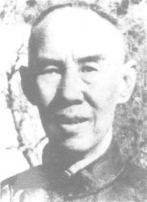

*Wang Xiang Zhai*

*YOU ARE LIKE THE HIBERNATING DRAGON*

*In the mid- 1940s an announcement appeared in the Chinese newspaper Shibao and in some other journals outside China inviting anyone to come and beat up a middle-aged gentleman living in Beijing'. No one who took up the challenge ever succeeded. No wonder - they had tried to overcome Wang Xiang Zhai, the founder of a form of martial art known as Great Achievements Shadow Boxing, or
Da Cheng Chuan.
The basic training for anyone ivho wishes to practise
Da Cheng Chuan (pronounced Da-chen-chwan) is the series of standing exercises ofZhan Zhuang. As Master Wang himself explained to his students, "Action originates in inaction and stillness is the mother- of movement."
Master Wang's style was the result of years of study. As a child he sufferedfrom poor health and was encouraged to improve
his physical condition by taking up martial arts training under Master- Guo Yunshan who lived in his village.
After Master Guo's death, Wang Xiang Zhai spent the next 10 years travelling throughout China meeting and studying under the great martial arts masters of the day.
By the mid-1940s, Wang Xiang Zhai was ready to launch his new style, Da Cheng Chuan, and came to Beijing where he was soon recognized as a master of extraordinary wisdom andprowess.
To help his students, who spent hours under- his guidance, standing like a tree, Master Wang composed verses that condensed the essence of his teaching:*

*"Propelled by natural strength,*  
*You are as strong as a dragon.* 
*Inhaling and exhaling naturally and quietly,*  
*You perceive the mechanism of all movement.*

*Avail yourself of the force of the Universe,*   
*And bring your instinctive ability into full play.*

*In motion you are like the angry tiger, *
*In quietness you are like the hibernating dragon."*

### THE CHINESE WAY

The Chinese have studied the energy of the human body for thousands of years. This study is one of the earliest activities recorded in human civilization and dates back to the reign of the Yellow Emperor (thought to have been 2690-2590 BC). It
continues to expand and develop to this very day. The results form a sophisticated and meticulous body of knowledge bringing together three disciplines usually treated as completely separate in the West: medicine, philosophy, and the martial arts.

Central to the Chinese analysis of energy and its behaviour is the concept of Chi (pronounced "chee"). The Chinese character for Chi (see above) has several meanings. It can mean "air" or "breath", but it is most commonly used to represent the concept of "energy" or "vital essence". In the human body, Chi is the fundamental energy that sustains life and is present in the vibrating biological processes of every single one of the millions and millions of cells. It drives all the activities throughout the organism. This energy is not uniquely human. Every being shares in and is a natural manifestation of the vast Chi or fundamental energy of the universe. Just as modern science has demonstrated the elegant unity and constant inter-relationship of all matter and energy in the elemental structures and processes of our planet and the known cosmos, so too has the cumulative Chinese understanding of Chi been based on minute observation of a correspondingly delicate and interdependent web of energy patterns flowing through and forming the basis of all that exists.

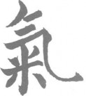

*The Chinese character Chi*

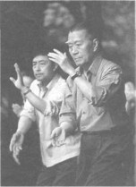

*Chinese people practise Tai Chi together in local parks.*

### THE HUMAN ENERGY SYSTEM

One of the great contributions of early Chinese culture was the discovery that it was possible to trace and analyse very precisely the patterns of energy within the human body. This knowledge could then be used as the basis of both preventive health care and the treatment of disease.

China's most famous physicians and philosophers have contributed extensively to the analysis and practical application of the body's energy systems. From this study have come the distinctive characteristics of traditional Chinese medicine, including the practices of acupuncture and herbal medicine, and a set of exercise systems that strengthen the body internally.

Throughout the body your energy circulates along channels which in the West are called "meridians". These often run in parallel with your cardiovascular system. Through an ever finer network of radiating routes, the Chi animates the entire living matter of your body.

### ENERGY BLOCKAGES

The Chi network is like any transportation system. If there is a blockage at any major point, this will automatically overload the

S) stem. In the short term, the network can usually cope with an overload by compensating in some way, but in the long term, permanent deformation or damage can occur if it persists.

Blockages in the Chi network can be caused by a range of factors. Sometimes serious disruption can be caused by bruising, muscle injuries, and sprains, especially if these are not treated properly and immediately. Long periods of sitting (common in office work and in other types of institutional work) as well as internal pressures generated by nervous tension can also block the Chi circulation. Even an extremely sedentary existence, without injury or tension, can lead to degeneration of the Chi network through irregular use or poor maintenance. Properly cared for. however, its life-enhancing properties will continue to sustain a vigorous and healthy existence for years and years.

Hie ancient Chinese discovered that it was possible to develop and direct the body's vital energy in particular ways. It could be nurtured to help prevent disease and premature ageing. It could be made to flow from one person to another and thereby used to help heal the sick. It could also be employed with powerful effect in the martial arts. The exercise systems used to stimulate and channel human energy came to be known as Chi Kung, which literally means "energy exercise", of which the Zhan Zhuang system is one part (see Chi Kung — the Energy Exercise, on p. 20). Some forms of Chi Kung focus exclusively on the mind, posture, breathing, or movement, or combine only some of these elements. Zhan Zhuang, the system described in this book, ultimately fuses all four together.

### CHI KUNG - THE ENERGY EXERCISE

The goal of Chi Kung exercise is to stimulate the flow of energy' internally in the body so that it effectively rushes through and clears the entire network of Chi channels, or "meridians".

Extensive research has been done over the years to develop a system of exercise that would speed up the blood circulation (and hence also stimulate the flow of Chi) without placing an intolerable strain on the lungs. The results drew on the accumulated wisdom of Chinese Taoist and Buddhist breathing practices and the practices and disciplines of the martial arts. Chi Kung, as the resulting exercises were known, used a series of breathing exercises to control the internal movement of Chi while the body remained virtually motionless.

For centuries most knowledge about Chi Kung was passed on within families

or small circles of masters and students and kept relatively secret. It is only recently that it has been taught and discussed publicly. There are a growing number of applications of Chi Kung exercise, ranging from the treatment of chronic illness through to the development of extraordinary physical powers that enable practitioners to break stones with their bare fingers. Now, it is increasingly being used to assist in the treatment of illnesses that Western medical practice cannot treat successfully. It is also being used to help prevent illness by building up the body's immune systems and internal strength. What Chi Kung offers is a method of training the nervous system, the mind, and the internal organs simultaneously, so that the inner strength of the whole person is raised to a new level of power and fitness.

ONE DESTINATION, MANY ROUTES

There are many styles and schools of Chi Kung. There is Chi Kung for health, for therapy, for martial arts, and for spiritual development.

There are Buddhist and Taoist schools of Chi Kung. In the martial arts, Chi Kung training includes techniques known as "iron palm", "iron shirt", and "metal bell cover". In athletics Chi Kung is used to develop muscle power and endurance. In medicine, especially in China, there are two main branches of Chi Kung: one is moving Chi Kung which involves movement exercise; the other is limited to static breathing and meditational exercises.

In the spiritual field, there are Chi Kung exercises that enable the student to experience other dimensions, and to develop telepathic powers.

The goal, however, of building internal strength, remains fundamental to all.

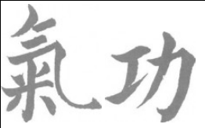

*Chi Kung*

The ability to transform energy and even create it within you is one of the profound secrets of life. Like a tree, you are one of the great power-stations of nature. You share a deep affinity with the countless trees and saplings that surround you on the planet. They have much to teach us. They are perfectly adapted to the rhythm of the seasons. They combine immense strength with the most delicate sensitivity. They turn sunlight and air into fuel.
They share the earth with others, but are secure within themselves.
This is the vision of life so beautifully expressed in the ancient Taoist classic of Lao Tzu, the Tao Teh Ching:

Standing alone and unchanging,  
One can observe every mystery, 
Present at every moment and ceaselessly continuing —  
This is the gateway to indescribable marvels.

This is one of the earliest references to Zhan Zhuang. You are standing like a tree, alone and unmoving. You come to under- stand everything that happens within you — all the internal changes that take place in your organs and muscles. You practise constantly. You feel the reactions taking place. The feeling never stops. It goes on and on, over and over again. This is the Way: no matter howT far you go you will never come to the end of all the wondrous things there are to discover.

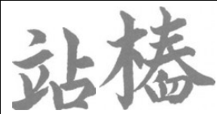

*Zhan Zhuang*

# PART ONE

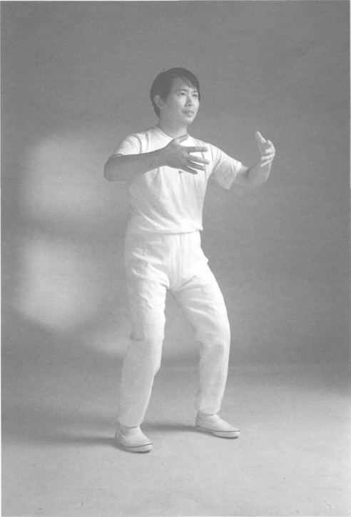

## LEARNING TO STAND

The Zhan Zhuang system begins with two basic standing exercises. These start to build up and release the natural flow of energy inside you. The first position, a simple standing posture (pp. 28-29), enables you to relax your body in preparation for the other exercises. The second position, "Holding the Balloon" (pp. 34-35), is the key position in the whole system. It is essential to become thoroughly comfortable in both these positions before moving on to the exercises in Part Two, the intermediate level.
The simple warm up routines on the following pages prepare your body for the internal changes that take place during the Zhan Zhuang exercises. They are essential for beginners, because although the standing positions do not look strenuous, if you do them properly the resulting activity inside your body is enormous, and affects your whole system.
During the exercises in this chapter you may feel a little weak, start to tremble, or begin to tense up. But don't move: breathe naturally and relax. Use the time to notice all the remarkable changes and sensations in your body. Remember: standing still is not doing nothing, it is the exercise.
When you are familiar with the first two standing exercises, you will need to learn how to breathe and relax, as described in Chapter 2. This will give you the experience of simultaneous exertion and relaxation during the standing postures, which is fundamental to this exercise system. The curious sensations you are likely to experience when you begin the exercises are described in Chapter 3.
Start by doing the standing exercises for five minutes a day. After three weeks, increase this to ten minutes. Three weeks later, aim for 15 minutes, and 20 minutes after a further three weeks. You can stand for longer if you wish, but 20 minutes will refresh your whole system. Follow the step-by-step advice, practising a little every day. Do not skip ahead: developing self- control is part of the training.

### Warming up

As with all exercise routines, the warm up is essential. It helps your body become flexible and helps open up the internal channels along which your energy flows. The two largest and most important joints are the knees and shoulders. So by loosening these up first you are most likely to get the rich benefits of the later Zhan Zhuang exercises.
As a beginner, it is important to do these warm up exercises every time you start your Zhan Zhuang practice. They will take you about six or seven minutes.
Regularly practised, they give long-term protection against arthritis and other painful ailments that reduce the original flexibility of the body. If you are an advanced student (for example, if you have practised Tai Chi Chuan for several years), you can warm up instead with the Ba Duan Jin system described in Chapter 4.

#### WHEN AND WHERE TO PRACTISE

First thing in the morning before eating is the best time to begin. At other times, allow half an hour after meals before starting the exercise.

Try to do the exercises where the air is fresh — outside is ideal, but a well- ventilated, quiet room is next best.

#### CLOTHING

Make sure you are relaxed and comfortable. Wear loose clothing while training.

Otherwise, loosen your collar and belt, and remove your wristwatch. Don't train in tight trousers or jeans, or wearing high-heeled shoes.

#### WARMING UP YOUR KNEES

The first warm up is for your knees. During the exercise, try to remain relaxed from your waist up. To avoid tension in your neck, look slightly down to a point about 2m (6ft) in front of you. For added benefit from this exercise, double the number of circles.

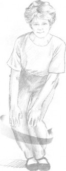

Stand with your feet together. Bend your knees and stoop over so that yon can just touch them with your fingers. With your hands on your knees, rotate your knees 30 times to the left I see left) and 30 times to the right.

#### LOOSENING YOUR SHOULDERS

The second warm up is for your shoulders. Make 30 to 40 complete circles with your arms. You should start very slowly, then speed up slightly, and

then slow down again toward the end. Do 60 circles for greater benefit.

Breathe in as your arms come up. Breathe out as they come down. If you are short of breath, breathe in and out as your arms come up, and in and out as they come down.

1. Stand with your feet a shoulder-width apart, toes pointing forward. Slowly raise your arms as if you u 'ere holding a large beach ball between your palms. When your hands are aboi 'e the top of your head, turn them outward.

2. Then lower your arms in an arc down toward your sides. As your hands move slowly down, imagine that each is gently pressing a smaller beach ball downward. Be careful not to hunch your shoulders. As your arms reach hip level, bring them forward gently so that they can hold the imaginary beach ball again before they start to move slowly upward.

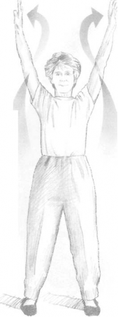

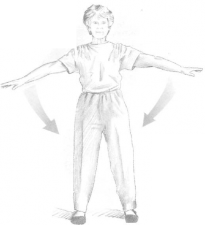

### Wu Chi - the first position

All Zhan Zhuang training begins with this position, which is profoundly important. Even at extraordinarily advanced levels of exercise, we begin with a period of quiet standing in the Wu Chi position - the position of primal energy.
The Wu Chi position involves simply standing still. It is an opportunity to pay careful attention to the tensions in your body and its nervous system. At the same time it becomes a moment of powerful, deep relaxation in your day. Simple as it may seem, this opening position, correctly practised, holds the key to unlock the storehouse of your great internal energy reserves.
It is a good idea to go to the toilet before starting, to ensure that you do not have to interrupt your stationary exercise.
Try to do your training outside, with your back toward the sun. If you can stand near a large tree with the sun on your back, this is the best location of all. Don't stand in the rain or fog.
If you're indoors, you can either use a quiet room or create a tranquil environment by playing a recording of softly flowing instrumental music.
